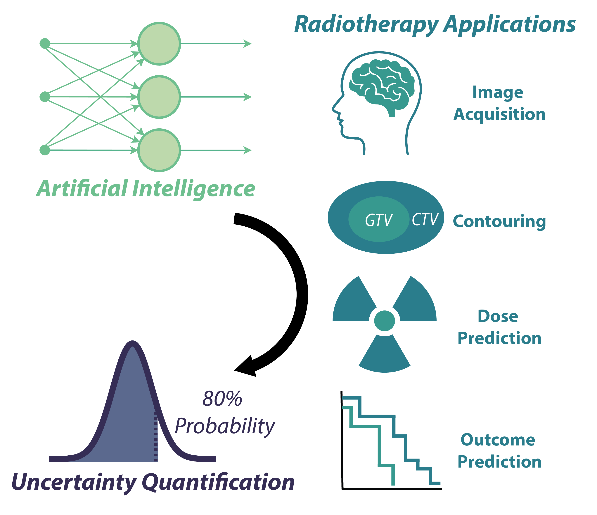

# RT_UQ_scoping_review
Repo for scoping review paper titled: "Artificial Intelligence Uncertainty Quantification in Radiotherapy Applications - A Scoping Review". 

This repo contains a Jupyter notebook of the main analysis script (Analysis_final.ipynb). Utilizes input files (CSV and excel) that are provided at the following Figshare doi: 10.6084/m9.figshare.25535017. 
